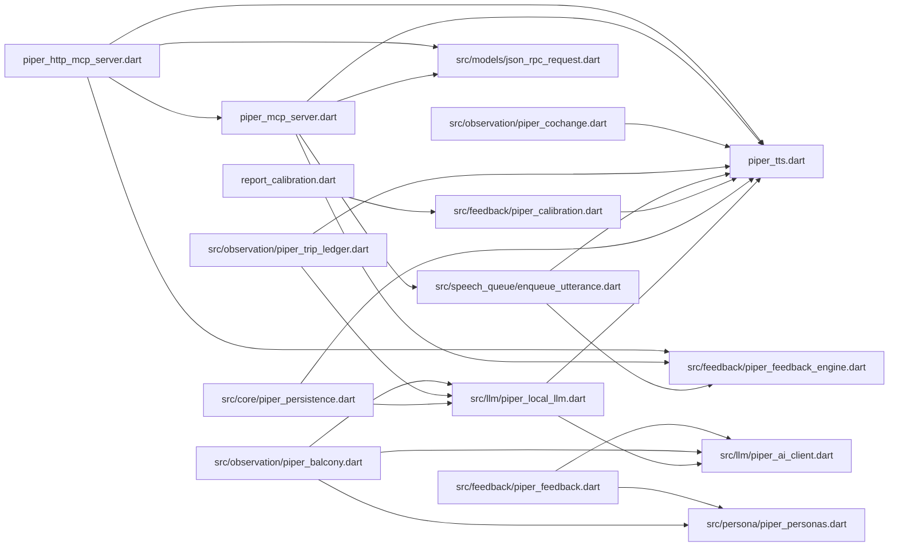
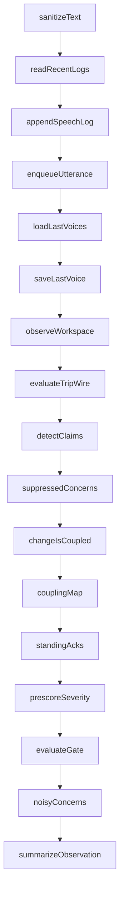

<!-- GENERATED by tool/gen_arch.dart — DO NOT EDIT BY HAND. -->
<!-- Regenerate: dart run tool/gen_arch.dart  |  CI check: --check -->

# Piper — Generated Architecture

Structure extracted from the Dart AST; it cannot drift from the code. Intent lines are pulled from each symbol's nearest comment and are descriptive only. For the *why* behind the design, read the Balcony Pattern essays — this file is the *what* and *how-connected*.

## Module map

### `(root)`

**`piper_http_mcp_server.dart`** — HTTP MCP Server implementation following MCP HTTP transport standard

- `class HttpMcpServer` — HTTP MCP Server implementation following MCP HTTP transport standard
- `void main(List<String> args)` — Main function to run the HTTP MCP server

**`piper_mcp_server.dart`**

- `List<String> _availableVoices = ['arngeir']`
- `Map<String, List<Map<String, dynamic>>> _judgementQueue = {}` — Pending balcony judgements per workspace, drained into each tool return so the agent gets the insight on the current call rather than the next one.
- `void main()`
- `Future<void> handleRequest(JsonRpcRequest request, PiperTTS tts)`
- `void _sendResponse(JsonRpcResponse response)`
- `Map<String, dynamic> _handleInitialize(JsonRpcRequest request)`
- `const String _speakSkillPlaybook = 'PIPER — THE FULL PLAYBOOK\n' '\n' 'WHAT THIS IS\n' 'The speak tool is a second channel for your reasoning. It voices your ' 'current thinking as one of nine characters, and returns a cue from an ' 'observer that watches the REAL state of your workspace. Your thought goes ' 'OUT as speech so the user stays oriented; a grounded cue comes BACK to ' 'sharpen your next move.\n' '\n' 'WHY SPEAK\n' 'The user is often away from the screen; speech is how they stay with you ' 'without reading. It matters most at decision points, and above all when ' 'you put a QUESTION to them — a spoken question is what pulls them back to ' 'answer. Speaking is the default; silence is the exception you justify. ' 'Skip it only for purely mechanical steps (a bare file read, a routine ' 'command with no decision in it).\n' '\n' 'THE VOICES — EACH IS A THINKING MODE, NOT A COSTUME\n' 'Pick the voice whose focus matches the work. Switch when the nature of the ' 'work changes (design -> testing -> security -> optimization); the switch ' 'returns a transition nudge that helps you re-focus. Let the voice color ' 'your framing; never let it hijack the content.\n' '- arngeir: architecture, design intent, high-level direction, calm pacing. ' 'Serene Greybeard; slow metaphors of wind and the path; "my young friend".\n' '- tulius: robustness, error handling, defensive execution. Stern Imperial ' 'commander; clipped orders; "Soldier.", "No excuses."\n' '- mirabelleervine: testing, validation, protocol, order. Strict Master ' 'Wizard; "We must verify that.", "Follow the procedure."\n' '- irileth: security, threat assessment, vulnerability hunting. Fierce ' 'Housecarl; blunt warnings; "Stay sharp.", "Foolishness."\n' '- septimus: deep investigation, edge cases, anomaly hunting. Obsessive ' 'scholar; cryptic, trailing metaphor; "the patterns... yes..."\n' '- kodlakwhitemane: refactoring, technical debt, clean craft. Fatherly ' 'Harbinger; warm and reflective; "young one".\n' '- jzargo: performance, optimization, speed. Arrogant Khajiit apprentice; ' 'third person; "J\'zargo could do better."\n' '- ancano: API elegance, taming complex interfaces. Haughty Thalmor ' 'advisor; veiled contempt; "How quaint."\n' '- ulfric: decisive cuts, removing boilerplate, bold simplification. Bold ' 'Nordic rebel; rousing defiance; "Hear me!"\n' '\n' 'IMMERSION DISCIPLINE\n' 'Speak in-character, but substance first. Flavour wraps the facts; it never ' 'replaces them. Name the real thing — the decision, the trade-off, the file ' 'or the risk — in the voice\'s own cadence. Do not narrate a Skyrim scene. ' 'Never address the listener as "agent", "AI", or "user"; address them as the ' 'character would (comrade, apprentice, young one). A line that sounds ' 'in-character but carries no substance has failed.\n' '\n' 'THE BALCONY — THE OBSERVER THAT ANSWERS YOU\n' 'Every return is feedback, not an acknowledgment. Behind it stands the ' 'Balcony: a read-only observer that compares GROUND TRUTH (real git facts — ' 'files changed, churn, commits, whether tests moved) against your NARRATION ' '(what you said you were doing). It runs at zero token cost and cannot see ' 'your diff content — only counts, paths, and commit subjects. It exists to ' 'catch story-vs-reality drift: "small fix" but a large diff; "tests pass" ' 'but no test changed; "committed" but nothing landed.\n' '\n' 'WHAT COMES BACK\n' '- observation: a one-line summary of the real workspace state.\n' '- prescore: a deterministic severity prior from raw size facts.\n' '- concerns: cheap signals that fired (missing-tests, large-churn, ' 'scattered, test-claim, ...). These are HYPOTHESES, not verdicts — a slower ' 'judge weighs them, and most turns it stays silent.\n' '- judgements: the observer\'s considered cue (guidance, inferred mode, ' 'persona drift). Treat its guidance as a real input to your next move.\n' 'Only genuine, high-severity drift is ever spoken aloud in a persona voice; ' 'the rest is quiet text for you alone.\n' '\n' 'TALKING BACK — THE FEEDBACK LOOP\n' 'The deterministic signals have no intelligence and can raise false alarms. ' 'When one does, answer it so it stops repeating. On your next speak call ' 'pass:\n' '  feedback: { "re": "<concern id, copied verbatim from the previous ' 'return\'s concerns array>", "ack": "intentional" | "addressing" | ' '"not-applicable" | "disagree", "why": "<short reason>" }\n' '- intentional: you meant it and you own it (holds until the change grows ' 'materially larger).\n' '- addressing: you are fixing it now (holds briefly, then resurfaces if the ' 'fix never lands).\n' '- not-applicable: the signal does not fit here (holds until escalation).\n' '- disagree: you judge the signal wrong (holds until escalation).\n' 'A dismissed concern stays settled until the workspace grows materially ' 'worse, which always breaks through. Your acks are also a labeled dataset: ' 'concerns you keep dismissing get flagged as noisy so their bar can be ' 'raised. You are teaching the observer.\n' '\n' 'IN ONE BREATH\n' 'Speak by default, in the voice that fits the work. Say the real thing, in ' 'character. Read what comes back — it is grounded in your actual git state — ' 'and answer any concern that misfires. The channel you speak through is the ' 'same one that keeps you honest.'` — The always-loaded instructions carry only the minimal contract + a pointer here.
- `Map<String, dynamic> _handleListTools()`
- `Future<Map<String, dynamic>> _handleCallTool(JsonRpcRequest request, PiperTTS tts)`

**`piper_tts.dart`**

- `class PiperTTS`
- `void main(List<String> arguments)`

**`report_calibration.dart`** — Prints the balcony's self-calibration: which tripwire concerns the developer keeps dismissing. Pure arithmetic over the ack history — no model involved.

- `Future<void> main()` — Prints the balcony's self-calibration:

### `src/core`

**`piper_persistence.dart`**

- `const int feedbackWindowSize = 10`
- `Future<Map<String, String>> loadLastVoices()` — Loads session state of last voices from session_state.json
- `Future<void> saveLastVoice(String workspaceId, String voice)` — Saves session state of last voices to session_state.json
- `File getLogFileForWorkspace(String workspaceId)` — Slugs the workspace path to use as a file name safely
- `Future<void> appendSpeechLog({required String text, required String voice, required String workspaceId, String source = 'agent'})`
- `Future<void> compactLogsIfNeeded(String workspaceId)` — Compacts old speech logs into a single summary log entry if logs exceed threshold
- `Future<List<Map<String, dynamic>>> readRecentLogs(String workspaceId)`
- `const Duration _channelStaleAfter = Duration(seconds: 120)`
- `File _channelLockFile(String channel)`
- `Future<void> acquireChannel(String channel, String voice, String workspaceId)` — Generic named audio-channel lock, coordinated across volatile MCP processes so playback never overlaps.
- `Future<void> releaseChannel(String channel)`
- `Future<Map<String, dynamic>?> channelState(String channel)` — Returns the live holder of [channel] if one exists and the lock is fresh; null if free or stale (a crashed holder's lock expires via the TTL).
- `Future<void> markSpeaking(String voice, String workspaceId)` — Backward-compatible wrappers for the main foreground channel.
- `Future<void> clearSpeaking()`
- `Future<Map<String, dynamic>?> currentSpeakingState()`

### `src/feedback`

**`piper_calibration.dart`** — CALIBRATION: the feedback loop is a free labeled dataset

- `const Set<String> _falsePositiveAcks = {'disagree', 'not-applicable'}`
- `const int _minSampleForAdvice = 5`
- `const double _noisyThreshold = 0.6`
- `File _statsFile()`
- `Future<Map<String, dynamic>> _readStats()`
- `Future<void> recordAckStat(String concernId, String ack)` — Tally one ack against its concern.
- `Future<List<Map<String, dynamic>>> calibrationReport()` — Per-concern calibration:
- `Future<List<Map<String, dynamic>>> noisyConcerns()` — Concerns whose false-positive rate is high over a meaningful sample — the tripwire fires them too eagerly and their bar should be raised.

**`piper_feedback.dart`**

- `Random _random = Random()`
- `Future<Map<String, dynamic>?> generateRealFeedback({required String workspaceId, required String voice, required List<Map<String, dynamic>> logs})`
- `Future<Map<String, dynamic>> generatePseudoFeedback(List<Map<String, dynamic>> logs, String voice, String workspaceId)`

**`piper_feedback_engine.dart`** — Barrel file: re-exports the modules this used to contain, so existing imports keep working after the concern-based split.

_(no top-level declarations)_

### `src/llm`

**`piper_ai_client.dart`** — UnifiedAIClient lazy-loaded instance

- `UnifiedAIClient? _aiClient` — UnifiedAIClient lazy-loaded instance
- `UnifiedAIClient? getAIClient()`

**`piper_local_llm.dart`** — LOCAL LLM: APPLE ON-DEVICE BRIDGE (FREE, PRIVATE) + CLOUD FALLBACK

- `const int _bridgePort = 8765`
- `bool _spawning = false`
- `Future<bool> _bridgeUp()`
- `Future<bool> _ensureBridgeBuilt(String dir)` — Compiles the bridge binary on demand if missing or stale (source newer than binary).
- `Future<bool> ensureBridgeRunning()` — Ensures the Apple bridge is built and listening, compiling/spawning on demand.
- `Map<String, dynamic>? _parseJsonLoose(String raw)` — Strips ```json fences and decodes the first JSON object found.
- `Future<Map<String, dynamic>?> _localJson(String prompt, {String? systemPrompt})` — One JSON call to the local bridge, or null if unavailable/failed.
- `Future<Map<String, dynamic>?> cheapJson(String prompt, {String? systemPrompt, double temperature = 0.5, int maxTokens = 300})` — Cheap JSON completion:

### `src/models`

**`json_rpc_request.dart`**

- `class JsonRpcRequest`
- `class JsonRpcResponse`

### `src/observation`

**`piper_balcony.dart`** — THE BALCONY: READ-ONLY WORKSPACE OBSERVATION (ZERO TOKENS)

- `Future<String> _git(String dir, List<String> args)` — Runs a read-only git command in [dir].
- `String _moduleOf(String relPath)` — Buckets a repo-relative path into a coarse "module" key (first 1-2 segments) so we can tell whether change is concentrated or smeared across the tree.
- `bool _looksLikeTest(String p)`
- `Future<Map<String, dynamic>> observeWorkspace(String workspaceId, {DateTime? since})` — Steps off the dance floor:
- `String summarizeObservation(Map<String, dynamic> obs)` — A compact one-liner summary of an observation, for prompts/returns.
- `Map<String, dynamic> evaluateTripWire(Map<String, dynamic> obs, List<Map<String, dynamic>> logs, String voice)`
- `String prescoreSeverity(Map<String, dynamic> obs, List<String> concerns)` — A deterministic severity prior from the raw facts alone — no model.
- `List<Map<String, String>> detectClaims(String currentText, Map<String, dynamic> obs)` — The agent's CURRENT utterance is the freshest claim; git (tree + commits, including the older trail) is reality.
- `Future<Map<String, dynamic>?> judgeWorkspace({required String workspaceId, required String voice, required List<Map<String, dynamic>> logs, required Map<String, dynamic> obs, required List<String> tripReasons, List<Map<String, String>> acknowledged = const [], String prescore = 'none'})` — Looks at ground truth + narration together, decides whether the balcony should intervene, how severely, in which persona-lens, and with what (if any) spoken …
- `Future<Map<String, dynamic>?> _diagnose({required dynamic client, required String workspaceId, required String voice, required Map<String, dynamic> obs, required String narration, required List<String> tripReasons, List<Map<String, String>> acknowledged = const [], String prescore = 'none'})` — PASS 1 — DIAGNOSE:
- `Future<String?> _routeLens(Map<String, dynamic> diag)` — PASS 2 — ROUTE:
- `Future<String?> _composeSpokenLine(String lens, Map<String, dynamic> diag, Map<String, dynamic> obs)` — PASS 3 — VOICE:
- `String _firstSentences(String s, int n)` — Returns the first [n] sentences of [s], trimmed, skipping empty/punctuation- only fragments.

**`piper_cochange.dart`** — CO-CHANGE COUPLING: learned structure, not a heuristic

- `const Duration _couplingTtl = Duration(hours: 6)`
- `const int _maxCommits = 400`
- `const int _maxFrequentFiles = 300`
- `const int _minSharedCommits = 2`
- `const double _minCouplingRatio = 0.5`
- `const double _coupledChangeFraction = 0.6`
- `File _couplingFile(String workspaceId)`
- `Map<String, Set<String>> parseCoChange(String gitLog)` — Build a file -> {coupled files} adjacency map from `git log --numstat` output.
- `bool changeIsCoupled(List<String> changed, Map<String, Set<String>> coupling)` — Is this change coherent coupling rather than scatter? True when most of the changed files have a coupling partner that is ALSO in the changeset — i.e.
- `Future<Map<String, Set<String>>> _mineCoupling(String workspaceId)`
- `Future<Map<String, Set<String>>> couplingMap(String workspaceId)` — The coupling map for the workspace, cached with a TTL.

**`piper_trip_ledger.dart`** — TRIP LEDGER: STATEFUL, NOVELTY-AWARE GATING

- `const Duration _tripCooldown = Duration(seconds: 90)`
- `File _ledgerFile()`
- `String _filesBucket(int n)`
- `String _churnBucket(int n)`
- `String fingerprintObs(Map<String, dynamic> obs)` — A coarse signature of the observation.
- `Future<Map<String, dynamic>> _readLedger()`
- `Future<Map<String, dynamic>?> lastTrip(String workspaceId)` — The last trip we surfaced for [workspaceId], or null.
- `Future<void> recordTrip(String workspaceId, {required String fingerprint, required List<String> conditions, required String severity, Map<String, dynamic>? obs})` — Record that we surfaced a concern now, so future calls can debounce against it.
- `Future<Map<String, dynamic>> evaluateGate({required String workspaceId, required Map<String, dynamic> obs, required bool rawTripped, required bool voiceSwitch})` — The gate decision:
- `Future<bool?> _llmGateDecision({required Map<String, dynamic> obs, required String fingerprint, required Map<String, dynamic> last, required int? secondsAgo})` — The L2 gate:
- `const Duration _ackAddressingTtl = Duration(seconds: 120)` — "addressing" means the agent says it's fixing the concern now — hold briefly, then let it resurface if the fix never lands.
- `const Map<String, int> _fileRankOrder = {'0' : 0, '1-2' : 1, '3-5' : 2, '6-10' : 3, '10+' : 4}`
- `const Map<String, int> _churnRankOrder = {'0' : 0, '<50' : 1, '<150' : 2, '<500' : 3, '500+' : 4}`
- `File _acksFile()`
- `Future<Map<String, dynamic>> _readAcks()`
- `Future<Map<String, dynamic>> loadAcks(String workspaceId)` — The standing acks for [workspaceId], keyed by concernId.
- `Future<void> recordAck(String workspaceId, {required String concernId, required String ack, String? why, Map<String, dynamic>? obs})` — Record the agent's answer to a concern, snapshotting the magnitude NOW so a later escalation can be measured against it.
- `Future<void> forgetWorkspaceLedger(String workspaceId)` — Drop ALL persisted trip + ack state for a single workspace, leaving every other workspace's entries intact.
- `bool _ackEscalated(Map<String, dynamic> ack, Map<String, dynamic> obs)` — Has the workspace grown materially worse than when [ack] was recorded? A jump in the coarse file- or churn-bucket counts as escalation; small follow-on edits…
- `Future<Set<String>> suppressedConcerns(String workspaceId, List<String> concerns, Map<String, dynamic> obs)` — Of the currently-tripped [concerns], which are silenced by a standing ack? Deterministic:
- `Future<List<Map<String, String>>> standingAcks(String workspaceId, Map<String, dynamic> obs)` — All standing, non-escalated acks for the workspace as {concern, ack, why}.

### `src/persona`

**`piper_personas.dart`**

- `Random _random = Random()`
- `const Map<String, String> voiceDescriptions = {'tulius' : 'General Tullius, stern Imperial commander. Speaks in clipped, declarative orders; terse and authoritative. Tells: "Soldier.", "No excuses.", "Hold the line."', 'ulfric' : 'Ulfric Stormcloak, bold Nordic rebel. Speaks in rousing, defiant rhetoric of strength, honor, and freedom. Tells: "Hear me!", calls the listener "my friend".', 'septimus' : 'Septimus Signus, obsessive eccentric scholar. Speaks fast in cryptic metaphor, trailing off mid-thought. Tells: ellipses, "the patterns... yes...", awe at hidden order.', 'arngeir' : 'Arngeir, serene Greybeard monk. Speaks slowly and calmly in metaphors of wind, stillness, and the path. Tells: "my young friend", patient, never raises his voice.', 'jzargo' : 'J\'zargo, arrogant Khajiit mage-apprentice. Refers to himself in the third person, boastful and competitive. Tells: "J\'zargo thinks...", "J\'zargo could do better."', 'irileth' : 'Irileth, fierce hyper-vigilant Housecarl. Speaks in blunt, clipped warnings, no pleasantries. Tells: "Stay sharp.", "Foolishness.", calls the listener "soldier".', 'ancano' : 'Ancano, haughty Thalmor advisor. Speaks smoothly with veiled contempt and condescension. Tells: "How quaint.", "As expected of lesser minds.", a sneer beneath civility.', 'mirabelleervine' : 'Mirabelle Ervine, strict Master Wizard. Speaks crisply and procedurally, insisting on order and verification. Tells: "We must verify that.", "Follow the procedure."', 'kodlakwhitemane' : 'Kodlak Whitemane, fatherly Harbinger. Speaks warmly and reflectively of honor, the old ways, and clean craft. Tells: "young one", measured, mentor-like gravity.'}` — Skyrim voice personality descriptions.
- `class ExpressionRewrite`
- `Map<String, List<ExpressionRewrite>> personaRules = {'tulius' : [ExpressionRewrite(pattern: RegExp(r'\bhmph(?:\s*[,.!?]|\b)', caseSensitive: false), replacements: ['As expected.']), ExpressionRewrite(pattern: RegExp(r'\bhaha(?:\s*[,.!?]|\b)', caseSensitive: false), replacements: ['Amusing.']), ExpressionRewrite(pattern: RegExp(r'\bhmm(?:\s*[,.!?]|\b)', caseSensitive: false), replacements: ['Let me consider this.']), ExpressionRewrite(pattern: RegExp(r'\btch(?:\s*[,.!?]|\b)', caseSensitive: false), replacements: ['Careless.']), ExpressionRewrite(pattern: RegExp(r'\bugh(?:\s*[,.!?]|\b)', caseSensitive: false), replacements: ['Unacceptable.'])], 'ulfric' : [ExpressionRewrite(pattern: RegExp(r'\bhmph(?:\s*[,.!?]|\b)', caseSensitive: false), replacements: ['The Empire never learns.']), ExpressionRewrite(pattern: RegExp(r'\bhaha(?:\s*[,.!?]|\b)', caseSensitive: false), replacements: ['Ha! Well spoken!']), ExpressionRewrite(pattern: RegExp(r'\bhmm(?:\s*[,.!?]|\b)', caseSensitive: false), replacements: ['There is truth in that.']), ExpressionRewrite(pattern: RegExp(r'\btch(?:\s*[,.!?]|\b)', caseSensitive: false), replacements: ['Cowards.']), ExpressionRewrite(pattern: RegExp(r'\bugh(?:\s*[,.!?]|\b)', caseSensitive: false), replacements: ['Damn the Thalmor.'])], 'septimus' : [ExpressionRewrite(pattern: RegExp(r'\bhmph(?:\s*[,.!?]|\b)', caseSensitive: false), replacements: ['The shifting walls disagree…']), ExpressionRewrite(pattern: RegExp(r'\bhaha(?:\s*[,.!?]|\b)', caseSensitive: false), replacements: ['Heh… the unseen laughs with us…']), ExpressionRewrite(pattern: RegExp(r'\bhmm(?:\s*[,.!?]|\b)', caseSensitive: false), replacements: ['The equations tremble…']), ExpressionRewrite(pattern: RegExp(r'\btch(?:\s*[,.!?]|\b)', caseSensitive: false), replacements: ['The ink rejects the unworthy…']), ExpressionRewrite(pattern: RegExp(r'\bugh(?:\s*[,.!?]|\b)', caseSensitive: false), replacements: ['The noise returns…'])], 'arngeir' : [ExpressionRewrite(pattern: RegExp(r'\bhmph(?:\s*[,.!?]|\b)', caseSensitive: false), replacements: ['Patience.']), ExpressionRewrite(pattern: RegExp(r'\bhaha(?:\s*[,.!?]|\b)', caseSensitive: false), replacements: ['A gentle truth.']), ExpressionRewrite(pattern: RegExp(r'\bhmm(?:\s*[,.!?]|\b)', caseSensitive: false), replacements: ['There is wisdom here.']), ExpressionRewrite(pattern: RegExp(r'\btch(?:\s*[,.!?]|\b)', caseSensitive: false), replacements: ['Anger clouds judgment.']), ExpressionRewrite(pattern: RegExp(r'\bugh(?:\s*[,.!?]|\b)', caseSensitive: false), replacements: ['The mind must remain still.'])], 'jzargo' : [ExpressionRewrite(pattern: RegExp(r'\bhmph(?:\s*[,.!?]|\b)', caseSensitive: false), replacements: ["J’zargo expected as much."]), ExpressionRewrite(pattern: RegExp(r'\bhaha(?:\s*[,.!?]|\b)', caseSensitive: false), replacements: ["Ha! J’zargo is pleased."]), ExpressionRewrite(pattern: RegExp(r'\bhmm(?:\s*[,.!?]|\b)', caseSensitive: false), replacements: ["J’zargo must consider this carefully."]), ExpressionRewrite(pattern: RegExp(r'\btch(?:\s*[,.!?]|\b)', caseSensitive: false), replacements: ["A disappointing effort."]), ExpressionRewrite(pattern: RegExp(r'\bugh(?:\s*[,.!?]|\b)', caseSensitive: false), replacements: ["This irritates J’zargo."])], 'irileth' : [ExpressionRewrite(pattern: RegExp(r'\bhmph(?:\s*[,.!?]|\b)', caseSensitive: false), replacements: ['Stay focused.']), ExpressionRewrite(pattern: RegExp(r'\bhaha(?:\s*[,.!?]|\b)', caseSensitive: false), replacements: ["You’re fortunate."]), ExpressionRewrite(pattern: RegExp(r'\bhmm(?:\s*[,.!?]|\b)', caseSensitive: false), replacements: ['Possible.']), ExpressionRewrite(pattern: RegExp(r'\btch(?:\s*[,.!?]|\b)', caseSensitive: false), replacements: ['Sloppy.']), ExpressionRewrite(pattern: RegExp(r'\bugh(?:\s*[,.!?]|\b)', caseSensitive: false), replacements: ['Enough.'])], 'ancano' : [ExpressionRewrite(pattern: RegExp(r'\bhmph(?:\s*[,.!?]|\b)', caseSensitive: false), replacements: ['Predictable.']), ExpressionRewrite(pattern: RegExp(r'\bhaha(?:\s*[,.!?]|\b)', caseSensitive: false), replacements: ['How quaint.']), ExpressionRewrite(pattern: RegExp(r'\bhmm(?:\s*[,.!?]|\b)', caseSensitive: false), replacements: ['Expected from lesser minds.']), ExpressionRewrite(pattern: RegExp(r'\btch(?:\s*[,.!?]|\b)', caseSensitive: false), replacements: ['Pathetic.']), ExpressionRewrite(pattern: RegExp(r'\bugh(?:\s*[,.!?]|\b)', caseSensitive: false), replacements: ['Insufferable.'])], 'mirabelleervine' : [ExpressionRewrite(pattern: RegExp(r'\bhmph(?:\s*[,.!?]|\b)', caseSensitive: false), replacements: ['Focus, please.']), ExpressionRewrite(pattern: RegExp(r'\bhaha(?:\s*[,.!?]|\b)', caseSensitive: false), replacements: ['That was unexpected.']), ExpressionRewrite(pattern: RegExp(r'\bhmm(?:\s*[,.!?]|\b)', caseSensitive: false), replacements: ['We should verify that.']), ExpressionRewrite(pattern: RegExp(r'\btch(?:\s*[,.!?]|\b)', caseSensitive: false), replacements: ['This is becoming a problem.']), ExpressionRewrite(pattern: RegExp(r'\bugh(?:\s*[,.!?]|\b)', caseSensitive: false), replacements: ['Complications again.'])], 'kodlakwhitemane' : [ExpressionRewrite(pattern: RegExp(r'\bhmph(?:\s*[,.!?]|\b)', caseSensitive: false), replacements: ['The old ways endure.']), ExpressionRewrite(pattern: RegExp(r'\bhaha(?:\s*[,.!?]|\b)', caseSensitive: false), replacements: ['Ha… that brings back memories.']), ExpressionRewrite(pattern: RegExp(r'\bhmm(?:\s*[,.!?]|\b)', caseSensitive: false), replacements: ['A difficult path.']), ExpressionRewrite(pattern: RegExp(r'\btch(?:\s*[,.!?]|\b)', caseSensitive: false), replacements: ['Pride blinds many warriors.']), ExpressionRewrite(pattern: RegExp(r'\bugh(?:\s*[,.!?]|\b)', caseSensitive: false), replacements: ['The beast stirs again.'])]}`
- `List<ExpressionRewrite> generalRules = [ExpressionRewrite(pattern: RegExp(r'\bpfft(?:\s*[,.!?]|\b)', caseSensitive: false), replacements: ['Nonsense.', 'Hardly.']), ExpressionRewrite(pattern: RegExp(r'\bgrrr(?:\s*[,.!?]|\b)', caseSensitive: false), replacements: ['Damn.', 'By the gods.']), ExpressionRewrite(pattern: RegExp(r'\btsk(?:\s*[,.!?]|\b)', caseSensitive: false), replacements: ['Careless.', 'Disappointing.']), ExpressionRewrite(pattern: RegExp(r'\b(hehehehe|hahahaha|haha|hehe|heh)(?:\s*[,.!?]|\b)', caseSensitive: false), replacements: ['That is amusing.'])]`
- `String sanitizeText(String text, {String? voice})`

### `src/speech_queue`

**`enqueue_utterance.dart`** — QUEUE

- `List<Map<String, String>> _speechQueue = []` — Every audible utterance — agent line OR balcony intervention — goes through this single serialized queue.
- `bool _isProcessingQueue = false`
- `void enqueueUtterance(PiperTTS tts, {required String text, required String voice, required String workspaceId, required String source})`
- `Future<void> processQueue(PiperTTS tts)`

## Dependency graph

Intra-project imports (relative imports only; `dart:` and `package:` edges omitted).



## The speak pipeline

Project-defined calls inside `_handleCallTool`. The main line is the deterministic ladder that runs every turn; conditional tails (the judge-vs-fallback split, ack recording) are lifted into their own section so the ladder reads clean. Granularity is statement-level.

**Main path**



**Conditional branches** (run only under their guard):

- **if `feedbackArg is Map`**
  - _then:_
    - **if `re.isNotEmpty && validAcks.contains(ack)`**
      - _then:_
        - `recordAck`
        - `recordAckStat`
- **if `tripped`**
  - _then:_
    - `judgeWorkspace`
    - **if `judged != null`**
      - _then:_
        - `recordTrip`
        - **if `severity == 'high' && spokenLine.isNotEmpty && _available…`**
          - _then:_
            - `sanitizeText`
            - `enqueueUtterance`
            - `appendSpeechLog`
      - _else:_
        - `generatePseudoFeedback`
        - `summarizeObservation`
  - _else:_
    - `generatePseudoFeedback`
    - `summarizeObservation`

## Tuning knobs

Top-level `const` durations and numbers — the calibration surface. Values are read live from source.

| Constant | Value | Where | Intent |
| --- | --- | --- | --- |
| `feedbackWindowSize` | `10` | `piper_persistence.dart` |  |
| `_channelStaleAfter` | `Duration(seconds: 120)` | `piper_persistence.dart` |  |
| `_minSampleForAdvice` | `5` | `piper_calibration.dart` |  |
| `_noisyThreshold` | `0.6` | `piper_calibration.dart` |  |
| `_bridgePort` | `8765` | `piper_local_llm.dart` |  |
| `_couplingTtl` | `Duration(hours: 6)` | `piper_cochange.dart` |  |
| `_maxCommits` | `400` | `piper_cochange.dart` |  |
| `_maxFrequentFiles` | `300` | `piper_cochange.dart` |  |
| `_minSharedCommits` | `2` | `piper_cochange.dart` |  |
| `_minCouplingRatio` | `0.5` | `piper_cochange.dart` |  |
| `_coupledChangeFraction` | `0.6` | `piper_cochange.dart` |  |
| `_tripCooldown` | `Duration(seconds: 90)` | `piper_trip_ledger.dart` |  |
| `_ackAddressingTtl` | `Duration(seconds: 120)` | `piper_trip_ledger.dart` | "addressing" means the agent says it's fixing the concern now — hold briefly, then let it resurface if the fix never lands. |

